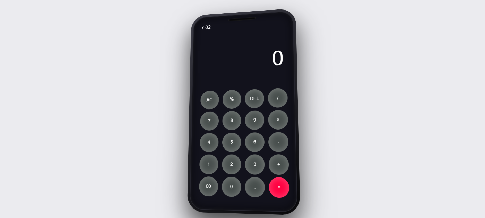

# 📱 Calculator Web App

<p align="center">
  <b>Mobile-inspired calculator built with HTML, CSS, and JavaScript</b>
</p>

<p align="center">
  
  
  
</p>

---

## 🔗 Live Demo

👉 https://jbmsacps-stack.github.io/calculator-webpage/calculator.html

---

## 📸 Preview



---

## 🧾 Overview

A fully functional calculator web application designed to replicate a **modern mobile calculator interface**.
This project emphasizes clean UI structure, responsive layout, and interactive behavior using core frontend technologies.

---

## ✨ Features

* Basic arithmetic operations: `+  −  ×  ÷`
* Input controls:

  * Clear (`AC`)
  * Delete (`DEL`)
* Real-time clock display (`HH:MM`)
* Interactive button states (hover & active effects)
* Mobile-style layout with rounded frame
* Smooth visual feedback and transitions

---

## 🏗️ Architecture

| Layer     | Technology | Responsibility                |
| --------- | ---------- | ----------------------------- |
| Structure | HTML       | Markup and layout             |
| Styling   | CSS        | UI design and visual effects  |
| Logic     | JavaScript | Input handling and evaluation |

---

## 🎨 Design Approach

* Dark theme for visual comfort
* Circular button system with inset glow effects
* Grid-based layout for consistent alignment
* Subtle transitions for interaction feedback
* Minimal, distraction-free interface

---

## ⚙️ Implementation Highlights

* DOM-based input handling for button interactions
* Expression evaluation using:

```javascript
eval(expression)
```

* Real-time clock implemented using:

```javascript
setInterval()
```

---

## 📂 Project Structure

```
.
└── index.html
```

---

## ⚠️ Technical Consideration

The project uses `eval()` for expression evaluation due to its simplicity.
For production-grade applications, it is recommended to replace this with a **custom parsing logic or a dedicated math library** to ensure safety and scalability.

---

## 🚀 Future Improvements

* Keyboard input support
* Safer calculation engine (without `eval`)
* Scientific calculator features
* Improved responsiveness across devices
* Enhanced UI animations and feedback

---

## 👤 Author

**JB**

---

## 📌 License

This project is intended for **learning and demonstration purposes only**.

---

<p align="center">
  ⭐ If you found this project useful, consider starring the repository.
</p>
